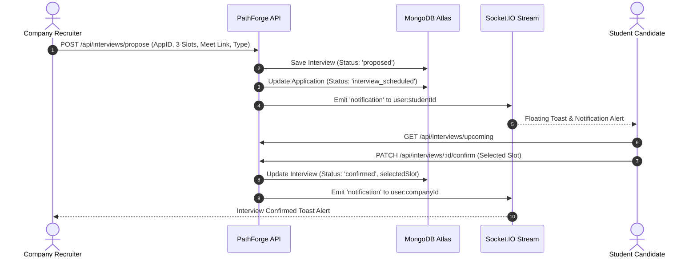
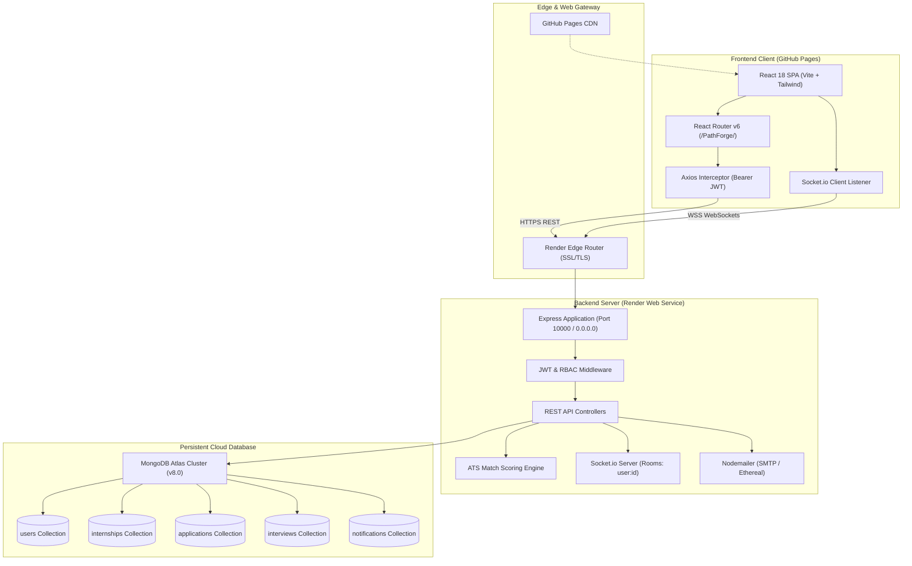
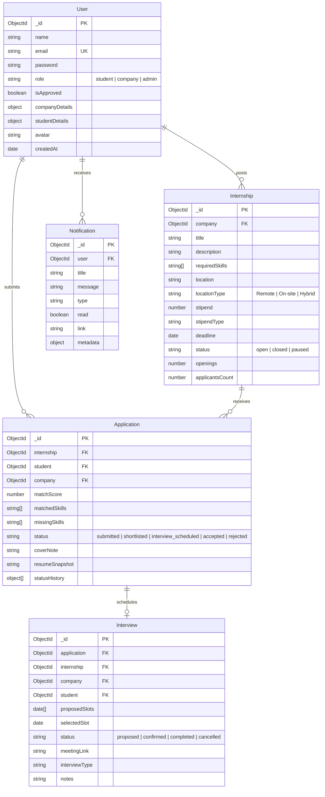
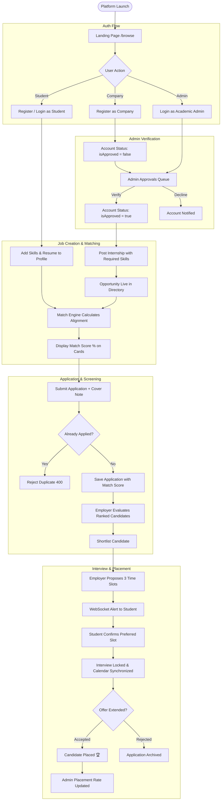

# PathForge 🎓💼
### Premium Academia-Industry Collaboration Platform for Internships & Placements

[](https://kkr-kkreddy-24a31a05kd.github.io/PathForge/)
[](https://pathforge-api-ngmj.onrender.com/health)
[](https://www.mongodb.com/atlas)
[](https://react.dev/)

---

## 📌 1. Project Title & Tagline

* **Project Title**: **PathForge**
* **Tagline**: *Where Academic Rigor Meets High-Impact Industry Careers.*
* **Live Web Application**: [https://kkr-kkreddy-24a31a05kd.github.io/PathForge/](https://kkr-kkreddy-24a31a05kd.github.io/PathForge/)
* **Production API Service**: [https://pathforge-api-ngmj.onrender.com/](https://pathforge-api-ngmj.onrender.com/)
* **API Health Check**: [https://pathforge-api-ngmj.onrender.com/health](https://pathforge-api-ngmj.onrender.com/health)

---

## 📖 2. Project Overview

**PathForge** is a full-stack, enterprise-grade Academia-Industry Collaboration Platform engineered to modernize university recruitment, internship allocation, and student placement workflows. 

By unifying university students, corporate recruiters, and academic placement directors within a single coordinated ecosystem, PathForge eliminates opaque hiring funnels through **deterministic ATS keyword matching algorithms**, **verified institutional company onboarding**, **real-time WebSocket status broadcasts**, and **multi-slot interview scheduling**.

---

## ❗ 3. Problem Statement

Traditional university placement processes and conventional job boards face major friction points:
1. **Opaque Qualification Criteria**: Students often apply blindly to internships without understanding how their curriculum and skills map to employer job descriptions.
2. **Manual Screening Bottlenecks**: Corporate recruiters receive hundreds of unranked resumes, causing delays and lost candidate opportunities.
3. **Disjointed Communication**: Interview scheduling and status updates are fragmented across third-party emails, chat apps, and manual spreadsheets.
4. **Lack of Institutional Visibility**: University placement directors lack real-time visibility into hiring velocities, enterprise partner authenticity, and curricular skill demands.

---

## 🎯 4. Project Objectives

1. **Automate Candidate-Opportunity Alignment**: Provide dynamic, real-time match scoring between candidate profiles and job requirements.
2. **Guarantee Institutional Trust**: Enforce an administrative verification gatekeeper for all participating enterprise companies.
3. **Streamline Scheduling**: Replace back-and-forth scheduling emails with an integrated multi-slot interview coordination system.
4. **Provide Instant Feedback**: Broadcast real-time application updates and scheduling alerts via WebSockets.
5. **Empower Placement Directors**: Provide macro-level institutional analytics tracking corporate hiring funnels, curricular skill trends, and placement rates.

---

## ⭐ 5. Key Features

* **Role-Based Access Control (RBAC)**: Distinct, authenticated workflows tailored for Students, Enterprise Recruiters, and Academic Administrators.
* **Algorithmic ATS Match Engine**: Deterministic NLP keyword normalization comparing student profiles and resume text against required competencies.
* **Interactive Resume Checker**: Pre-application sandbox allowing scholars to test and optimize resume keyword alignment against real job descriptions.
* **Corporate Verification Queue**: Admin gatekeeper preventing unapproved organizations from creating job listings.
* **Multi-Slot Interview Scheduling**: Employers propose up to 3 date/time slots with meeting links; students confirm their preferred time with 1 click.
* **Real-time Notifications**: Socket.IO event streaming for instant application status updates and interview invitations.
* **Interactive Data Dashboards**: Dynamic recruitment funnels and skill frequency charts built with Recharts.
* **Dark / Light Theme**: Complete, persistent theme support across all dashboards and modals.

---

## 👨‍🎓 6. Student Module

* **Personalized Dashboard**: View real-time application metrics, recommended internships sorted by highest match score, and upcoming interviews.
* **Internship Discovery**: Search opportunities by keyword, filter by skill tags, location type (Remote, Hybrid, On-site), and minimum stipend.
* **Match Score Transparency**: Badges on every opportunity card immediately indicate the percentage match to the student's profile.
* **Application Tracker**: Filter submissions by status (`submitted`, `shortlisted`, `interview_scheduled`, `accepted`, `rejected`), complete with audit history timelines and recruiter notes.
* **Academic & Professional Profile**: Manage skills, education credentials (degree, institution, GPA, graduation year), headline, bio, resume link, and raw resume text.
* **Interview Calendar**: Review proposed interview slots and confirm preferred meeting times.

---

## 🏢 7. Company Module

* **Enterprise Onboarding**: Companies register with organization details, industry, size, and website; accounts require administrative approval before posting jobs.
* **Job Posting Management**: Create opportunities with required technical skill tags, location, stipend type, duration, openings count, and application deadlines.
* **Status Lifecycle**: Toggle listings between `open`, `closed`, and `paused`.
* **Algorithmic Candidate Ranking**: View applicants ranked automatically by match score percentage; inspect candidate cover notes and resume snapshots.
* **Candidate Status Pipeline**: Progress candidates through stages (`submitted` → `shortlisted` → `interview_scheduled` → `accepted` / `rejected`).
* **Interview Coordination**: Propose up to 3 prospective time slots, attach Google Meet/Zoom video links, select interview types (Technical, Behavioral, Hiring Manager), and attach notes.
* **Recruitment Analytics**: Visualize 14-day application volume, candidate match score averages, and hiring funnel conversion rates.

---

## 👑 8. Admin Module

* **Platform Overview**: Monitor system-wide active internships, verified companies, pending verification queues, total students, total applications, and overall placement rate.
* **Enterprise Verification Queue**: Review company credentials and verify or decline corporate registration accounts with real-time socket and in-app alerts.
* **Curricular & Market Analytics**: Top 8 in-demand market skills extracted across all corporate postings, 30-day application timelines, and student/company entity distribution.
* **Entity Directory**: Search and inspect all registered students, enterprise partners, and administrators.

---

## 🧠 9. AI / ATS Matching Algorithm

The matching algorithm ([server/utils/matchCalculator.js](file:///c:/Users/kkred/OneDrive/Documents/PathForge/server/utils/matchCalculator.js)) implements deterministic keyword analysis:

### 1. Canonical Skill Normalization
```javascript
export const normalizeSkill = (skill) => {
  if (!skill || typeof skill !== 'string') return '';
  let s = skill.toLowerCase().trim();
  s = s.replace(/\.js\b/g, ''); // React.js -> react
  s = s.replace(/js\b/g, '');    // Nodejs -> node
  s = s.replace(/\+/g, 'p');     // C++ -> cpp
  s = s.replace(/#/g, 'sharp');  // C# -> csharp
  s = s.replace(/[^a-z0-9]/g, '');
  return s;
};
```

### 2. Multi-Tier Verification
For every required skill in an internship:
1. **Tier 1 (Declared Skill Check)**: Verifies exact and normalized matches against the student’s declared profile skills array.
2. **Tier 2 (Resume Text Word-Boundary Scan)**: If not found in declared skills, executes regex word-boundary substring analysis (`(?:\b|\s|_|-)<skill>(?:\b|\s|_|-)`) across the candidate's submitted resume text.

### 3. Match Score Calculation
$$\text{Match Score} = \text{round}\left( \frac{\text{Matched Skills Count}}{\text{Total Required Skills Count}} \times 100 \right)$$

### 4. Categorized Feedback
* **$\ge 80\%$**: *"Excellent profile alignment! You meet almost all core technical requirements."*
* **$50\% - 79\%$**: *"Strong match. Adding experience in [Missing Skills] would maximize your candidacy."*
* **$< 50\%$**: *"Consider upskilling in [Missing Skills] or tailoring your resume to highlight relevant projects."*

---

## 📄 10. Resume Checker

Accessible at `/student/resume-checker`, this feature provides a dedicated workspace for students:
* Select any active internship posting from a live dropdown.
* Paste resume text or load sample resumes (**Alex Rivera — Full Stack** or **Sarah Chen — AI/ML Researcher**).
* View instant visual match scores, matched skill tags (green), missing skill tags (red), and personalized recommendations prior to submitting an actual application.

---

## 📅 11. Interview Management

PathForge replaces back-and-forth scheduling emails with a synchronized scheduling workflow:



---

## 🔔 12. Real-Time Notifications

* **Socket Architecture**: Handshake authentication verifies JWT tokens before joining private socket rooms (`user:${userId}`).
* **Dispatched Events**:
  * Corporate account verified by Administrator
  * Candidate applies to an internship
  * Application shortlisted or updated by recruiter
  * Multi-slot interview invitation proposed
  * Interview slot confirmed by candidate
* **Persistence & Fallback**: All notifications are saved to MongoDB. A floating toast alert displays on screen for 6 seconds, while the unread badge updates in the top navigation bar. REST endpoints (`/api/notifications`) provide fallback if WebSockets are blocked by firewalls.

---

## 💻 13. Technology Stack

### Frontend Architecture
| Technology | Version | Purpose |
| :--- | :--- | :--- |
| **React** | `^18.3.1` | Declarative UI component library |
| **Vite** | `^5.3.4` | Next-generation frontend bundler & dev server |
| **Tailwind CSS** | `^3.4.7` | Utility-first design tokens & styling |
| **React Router DOM** | `^6.25.1` | Client-side routing with `basename` support |
| **Axios** | `^1.7.2` | HTTP client with automatic JWT interceptors |
| **Socket.io-client** | `^4.7.5` | Real-time bidirectional WebSocket events |
| **Recharts** | `^2.12.7` | Responsive recruitment funnels & analytics charts |
| **Lucide React** | `^0.418.0` | Modern, lightweight UI icon library |

### Backend Architecture
| Technology | Version | Purpose |
| :--- | :--- | :--- |
| **Node.js** | `v18+ / v20+` | Server-side JavaScript runtime (ES Modules) |
| **Express.js** | `^4.19.2` | RESTful API framework & routing engine |
| **Socket.io** | `^4.7.5` | WebSocket server for real-time notifications |
| **Mongoose** | `^8.5.2` | MongoDB Object Data Modeling (ODM) library |
| **Bcrypt.js** | `^2.4.3` | Cryptographic password hashing (10 salt rounds) |
| **JSONWebToken** | `^9.0.2` | Stateless authentication tokens (HMAC-SHA256) |
| **Nodemailer** | `^6.9.14` | Transactional email delivery with Ethereal dev fallback |
| **Dotenv** | `^16.4.5` | Zero-dependency environment variable manager |
| **Cors** | `^2.8.5` | Whitelist-based Cross-Origin Resource Sharing |

---

## 🏛️ 14. System Architecture Diagram



---

## 🔐 15. User Role & Access Matrix

| Feature / Action | Guest (Unauthenticated) | Student | Company (Unapproved) | Company (Approved) | Administrator |
| :--- | :---: | :---: | :---: | :---: | :---: |
| **View Landing Page & Stats** | ✅ | ✅ | ✅ | ✅ | ✅ |
| **Browse Active Internships** | ✅ | ✅ | ✅ | ✅ | ✅ |
| **View Match Score on Jobs** | ❌ | ✅ | ❌ | ❌ | ❌ |
| **Submit Application** | ❌ | ✅ | ❌ | ❌ | ❌ |
| **Track My Applications** | ❌ | ✅ | ❌ | ❌ | ❌ |
| **Use Resume Match Checker** | ❌ | ✅ | ❌ | ❌ | ❌ |
| **Confirm Interview Slot** | ❌ | ✅ | ❌ | ❌ | ❌ |
| **Post New Internship** | ❌ | ❌ | ❌ (403) | ✅ | ✅ |
| **Edit / Pause / Close Postings** | ❌ | ❌ | ❌ | ✅ (Owned) | ✅ |
| **View Candidates & Resumes** | ❌ | ❌ | ❌ | ✅ (Owned) | ✅ |
| **Propose Interview Slots** | ❌ | ❌ | ❌ | ✅ (Owned) | ✅ |
| **Company Hiring Analytics** | ❌ | ❌ | ❌ | ✅ (Owned) | ✅ |
| **Approve / Verify Companies** | ❌ | ❌ | ❌ | ❌ | ✅ |
| **System-wide Analytics Funnel**| ❌ | ❌ | ❌ | ❌ | ✅ |
| **User Directory (All Roles)** | ❌ | ❌ | ❌ | ❌ | ✅ |

---

## 🗄️ 16. Database Architecture & Collections

PathForge utilizes 5 collections within the `pathforge` database in MongoDB Atlas:



### Key Database Indexes
* **`User`**: Unique index on `email` (lowercase).
* **`Internship`**: Compound text index on `{ title: 'text', description: 'text', requiredSkills: 'text' }`.
* **`Application`**: Unique compound index on `{ internship: 1, student: 1 }` (guarantees a student can never submit duplicate applications to the same opportunity).
* **`Notification`**: Single index on `user` (ensures fast query speeds for user notification streams).

---

## 📡 17. REST API Documentation

### Base URLs
* **Production**: `https://pathforge-api-ngmj.onrender.com/api`
* **Local Development**: `http://localhost:5000/api`

### 1. Public & Health Endpoints
| Method | Endpoint | Access | Description | Sample Response |
| :--- | :--- | :--- | :--- | :--- |
| `GET` | `/` | Public | Root API status verification | `{"success": true, "message": "PathForge API is running"}` |
| `GET` | `/health` | Public | Cloud provider health probe | `{"status": "ok", "service": "PathForge API"}` |
| `GET` | `/api/health`| Public | Detailed timestamped health | `{"status": "online", "platform": "PathForge API", "timestamp": "..."}` |
| `GET` | `/api/admin/stats` | Public | Live platform hero statistics | `{"success": true, "stats": {"totalInternships": 12, ...}}` |

### 2. Authentication (`/api/auth`)
| Method | Endpoint | Access | Description |
| :--- | :--- | :--- | :--- |
| `POST` | `/api/auth/register` | Public (Rate-limited) | Register new Student or Company account |
| `POST` | `/api/auth/login` | Public (Rate-limited) | Authenticate user and receive JWT Bearer token |
| `GET` | `/api/auth/me` | Protected | Restore active session user profile |
| `PUT` | `/api/auth/profile` | Protected | Update profile, bio, skills, or company details |

### 3. Internships (`/api/internships`)
| Method | Endpoint | Access | Description |
| :--- | :--- | :--- | :--- |
| `GET` | `/api/internships` | Public / Optional Auth | Search and filter active opportunities (attaches match score if student) |
| `GET` | `/api/internships/:id` | Public | Retrieve single internship details |
| `GET` | `/api/internships/company/my-postings` | Company / Admin | Retrieve all postings created by the authenticated company |
| `POST` | `/api/internships` | Approved Company / Admin | Create a new internship posting |
| `PUT` | `/api/internships/:id` | Approved Company / Admin | Update title, skills, stipend, or toggle status (`open`/`closed`/`paused`) |
| `DELETE`| `/api/internships/:id` | Approved Company / Admin | Delete an internship posting |

### 4. Applications (`/api/applications`)
| Method | Endpoint | Access | Description |
| :--- | :--- | :--- | :--- |
| `POST` | `/api/applications/apply/:internshipId` | Student | Submit application with cover note and resume text |
| `GET` | `/api/applications/my-applications` | Student | Retrieve student's submitted applications & history |
| `GET` | `/api/applications/internship/:internshipId/applicants` | Company (Owner) / Admin | Retrieve candidates for a specific posting ranked by match score |
| `PATCH`| `/api/applications/:id/status` | Company (Owner) / Admin | Update application status (`shortlisted`, `rejected`, etc.) |
| `POST` | `/api/applications/check-resume-score` | Protected | Test resume text against a posting without applying |

### 5. Interviews (`/api/interviews`)
| Method | Endpoint | Access | Description |
| :--- | :--- | :--- | :--- |
| `POST` | `/api/interviews/propose` | Approved Company / Admin | Propose up to 3 interview time slots with video link |
| `PATCH`| `/api/interviews/:id/confirm` | Student (Invited) | Student confirms preferred interview slot |
| `GET` | `/api/interviews/upcoming` | Protected | Get synchronized interview schedules for user |

### 6. Admin & Analytics (`/api/admin`, `/api/analytics`)
| Method | Endpoint | Access | Description |
| :--- | :--- | :--- | :--- |
| `GET` | `/api/admin/pending-companies` | Admin | List enterprise accounts awaiting approval |
| `PATCH`| `/api/admin/companies/:id/approve` | Admin | Approve or decline company verification |
| `GET` | `/api/admin/users` | Admin | User directory filtered by role (`all`/`student`/`company`/`admin`) |
| `GET` | `/api/analytics/admin` | Admin | Placement funnel, 30-day volume, top skills |
| `GET` | `/api/analytics/company` | Company / Admin | 14-day application volume, candidate match averages |

### 7. Notifications (`/api/notifications`)
| Method | Endpoint | Access | Description |
| :--- | :--- | :--- | :--- |
| `GET` | `/api/notifications` | Protected | Fetch last 30 notifications and unread counter |
| `PATCH`| `/api/notifications/:id/read` | Protected | Mark single notification as read |
| `PATCH`| `/api/notifications/read-all` | Protected | Mark all user notifications as read |

---

## 🔒 18. Authentication & Authorization

* **Stateless Tokens**: Issued upon valid login via `jwt.sign({ id }, JWT_SECRET, { expiresIn: '30d' })`.
* **Client Token Persistence**: Stored in `localStorage` under `pathforge_token`. Automatically injected into request headers via Axios interceptor:
  ```javascript
  config.headers.Authorization = `Bearer ${token}`;
  ```
* **Session Termination**: 401 Unauthorized responses trigger automatic cache invalidation and redirect to login, excluding credentials verification requests.
* **Role Guards**: Express middleware validates user role from database:
  ```javascript
  export const authorize = (...roles) => (req, res, next) => {
    if (!roles.includes(req.user.role)) {
      return res.status(403).json({ success: false, message: 'Forbidden resource' });
    }
    next();
  };
  ```

---

## 🛡️ 19. Security Features

1. **Password Hashing**: Bcrypt with 10 salt rounds; plaintext passwords never touch the database.
2. **Select-False Security**: `password` is marked `{ select: false }` in Mongoose to prevent accidental exposure in user queries.
3. **Strict RBAC Gating**: Server enforces permission checks authoritatively; client-side hiding is paired with server-side 403 blocks.
4. **Tenant Isolation**: Companies can only access applications and edit listings where `internship.company === req.user._id`.
5. **CORS Origin Validation**: Whitelists only approved domains (`https://kkr-kkreddy-24a31a05kd.github.io` and local development).
6. **Rate Limiting**: Built-in memory limiter restricts brute-force attempts on sensitive `/register` and `/login` endpoints (max 30 requests per 15 minutes).
7. **Database Credential Masking**: MongoDB connection errors sanitize connection URIs, preventing password leaks in logs.

---

## ⚙️ 20. Installation Instructions

### Prerequisites
* **Node.js**: `v18.0.0` or higher
* **npm**: `v9.0.0` or higher
* **Git**: Installed and configured

### Clone Repository
```powershell
git clone https://github.com/kkr-kkreddy-24a31a05kd/PathForge.git
cd PathForge
```

---

## 🛠️ 21. Local Development Setup

### 1. Install Dependencies
Install dependencies for both backend and frontend:
```powershell
# From the repository root:
npm --prefix server install
npm --prefix client install
```

### 2. Configure Backend Environment
Create `server/.env` (copy from `server/.env.example`):
```env
PORT=5000
NODE_ENV=development
JWT_SECRET=pathforge_jwt_super_secret_dev_key_2026

# Paste your MongoDB Atlas URI, or leave blank for automatic embedded MongoDB:
MONGODB_URI=

# Enable automatic demo data seeding on initial boot
SEED_DEMO_DATA=true

# Allowed client origin for CORS
CLIENT_URL=http://localhost:5173
```

### 3. Start Development Servers
Run backend and frontend concurrently:
```powershell
# In Terminal 1 (Backend Server):
npm --prefix server run dev

# In Terminal 2 (Frontend Client):
npm --prefix client run dev
```

* **Frontend UI**: [http://localhost:5173/PathForge/](http://localhost:5173/PathForge/)
* **Backend API**: [http://localhost:5000/](http://localhost:5000/)

---

## 🔑 22. Environment Variables

### Backend (`server/.env`)
| Variable | Required | Default | Purpose |
| :--- | :---: | :---: | :--- |
| `PORT` | No | `5000` | Port for Express server |
| `NODE_ENV` | Yes | `production` | Environment mode (`production` / `development`) |
| `JWT_SECRET` | Yes | *Required* | Secret key for signing authentication tokens |
| `MONGODB_URI`| Yes (Prod) | Embedded Dev | MongoDB Atlas connection string |
| `CLIENT_URL` | Yes | `https://...` | Allowed frontend origin(s) for CORS and Socket.io |
| `SEED_DEMO_DATA`| No | `true` | Seeds initial sample accounts and listings |
| `SMTP_HOST` | No | *(Ethereal)* | Custom SMTP mail server hostname |
| `SMTP_PORT` | No | `587` | Custom SMTP mail server port |
| `SMTP_USER` | No | *(Ethereal)* | SMTP username |
| `SMTP_PASS` | No | *(Ethereal)* | SMTP password |

### Frontend (`client/.env`)
| Variable | Required | Default | Purpose |
| :--- | :---: | :---: | :--- |
| `VITE_API_URL` | No | Render API | API base URL for Axios requests |
| `VITE_SOCKET_URL` | No | Render Host | WebSocket server URL |
| `VITE_BASE_PATH` | No | `/PathForge/` | Base URL path for Vite and React Router |

---

## 🚀 23. Production Deployment

### Backend on Render (Web Service)
Configured using [render.yaml](file:///c:/Users/kkred/OneDrive/Documents/PathForge/render.yaml):
* **Root Directory**: `server`
* **Build Command**: `npm install`
* **Start Command**: `npm start`
* **Health Check Path**: `/health`
* **Environment Variables**: Add `MONGODB_URI`, `JWT_SECRET`, `NODE_ENV=production`, `CLIENT_URL=https://kkr-kkreddy-24a31a05kd.github.io`.

### Frontend on GitHub Pages
* **Vite Base**: Configured in [client/vite.config.js](file:///c:/Users/kkred/OneDrive/Documents/PathForge/client/vite.config.js) as `/PathForge/`.
* **Router Basename**: Configured in [client/src/main.jsx](file:///c:/Users/kkred/OneDrive/Documents/PathForge/client/src/main.jsx) as `<BrowserRouter basename={import.meta.env.BASE_URL}>`.
* **Deep Linking**: Build script automatically copies `dist/index.html` to `dist/404.html` so direct page refreshes resolve without 404s.
* **Deploy Command**:
  ```powershell
  cd client
  npm run deploy
  ```

---

## 🌐 24. Live Application URL

* **Frontend**: [https://kkr-kkreddy-24a31a05kd.github.io/PathForge/](https://kkr-kkreddy-24a31a05kd.github.io/PathForge/)

---

## 🔌 25. Backend URL

* **Backend Base**: [https://pathforge-api-ngmj.onrender.com/](https://pathforge-api-ngmj.onrender.com/)
* **Health Probe**: [https://pathforge-api-ngmj.onrender.com/health](https://pathforge-api-ngmj.onrender.com/health)

---

## 👥 26. Demo Account Instructions

PathForge includes pre-seeded demo accounts with rich data ready for demonstration:

| Role | Email Address | Password | Profile Description |
| :--- | :--- | :--- | :--- |
| **Academic Director (Admin)** | `admin@pathforge.com` | `password123` | Institutional Director overseeing company approvals, user directories, and macro placement funnels. |
| **Enterprise Recruiter (Company)** | `company@pathforge.com` | `password123` | Marcus Thorne — Head of Talent at Apex Cloud Systems. Manages active postings, reviews candidates, and schedules interviews. |
| **Student Scholar (Student)** | `student@pathforge.com` | `password123` | Alex Rivera — Senior CS Scholar at Stanford University (3.89 GPA). 100% skill match for Full-Stack roles. |

> [!TIP]
> You can log into any of these accounts with **1 Click** using the Quick Demo buttons on the Landing Page hero or the Login page.

---

## 🔄 27. Project Workflow



---

## ✨ 28. Advantages of PathForge

1. **Zero Guesswork for Students**: Clear skill-match scores help students understand where they stand before applying.
2. **Accelerated Screening for Recruiters**: Automated candidate ranking reduces screening time from hours to seconds.
3. **Verified Ecosystem**: Mandatory administrative approval protects students from fraudulent postings.
4. **Frictionless Interview Scheduling**: Multi-slot scheduling eliminates email ping-pong.
5. **Real-Time Responsiveness**: WebSockets ensure users receive instant status updates without page refreshing.

---

## ⚠️ 29. Limitations

1. **Text-Based Resume Extraction**: The ATS keyword matcher evaluates raw text pasted or stored in student profiles; it does not parse binary `.pdf` attachments directly.
2. **Third-Party Video Infrastructure**: The platform generates meeting links (e.g., Google Meet / Zoom) rather than hosting in-browser WebRTC video calls.
3. **Password Recovery**: Password resets require administrator assistance; self-service email OTP resets are not yet implemented.

---

## 🔮 30. Future Enhancements

* **AI Resume Parser**: Integrate OCR/PDF parsing to automatically extract skills and work experience from uploaded PDF resumes.
* **In-App Messaging**: Add direct real-time chat between students and recruiters.
* **Campus Placement Drives**: Support multi-stage assessment rounds (online aptitude tests, coding evaluations, and HR rounds).
* **Automated Offer Letters**: Digital signing and generation of internship offer letters directly within the platform.

---

## 🎓 31. B.Tech Project Information

* **Degree / Course**: Bachelor of Technology (B.Tech) in Computer Science & Engineering
* **Project Title**: **PathForge — Premium Academia-Industry Collaboration Platform for Internships & Placements**
* **Project Domain**: Full-Stack Web Development, Human Resource Technology (HRTech), Applied NLP / Information Retrieval
* **Core Technological Contributions**:
  * Deterministic skill normalization algorithm for resume keyword density matching.
  * Role-Based Access Control (RBAC) security architecture in modern Node.js ES Modules.
  * Event-driven WebSocket notification architecture using Socket.IO.
  * Cloud-native deployment utilizing MongoDB Atlas compound indexing and Render PaaS.

---

### Key Viva-Voce Defense Topics

1. **Why deterministic keyword normalization instead of generic LLM prompts?**
   * *Answer*: Deterministic normalization ensures predictable, instant, zero-cost, and explainable scoring for academic compliance, eliminating LLM hallucinations and API rate limits.
2. **How is data integrity preserved between concurrent applications?**
   * *Answer*: MongoDB enforces a unique compound index on `{ internship: 1, student: 1 }`, guaranteeing at the database engine level that no race condition can generate duplicate submissions.
3. **How does the system ensure security across tenants?**
   * *Answer*: Server-side authorization middleware strictly validates that `internship.company.toString() === req.user._id.toString()`, ensuring companies cannot view or modify competitor applications.
4. **How are WebSockets handled when users are offline?**
   * *Answer*: PathForge uses a hybrid notification system: events are always written to the persistent MongoDB `Notification` collection first, and then emitted to active socket rooms. Users who reconnect retrieve all missed notifications via REST fallback.

---

**PathForge** &copy; 2026. Developed with academic rigor and modern software engineering practices.
